## 顶层

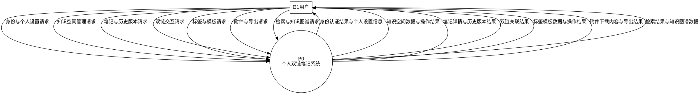

## 零层

### 总零层图

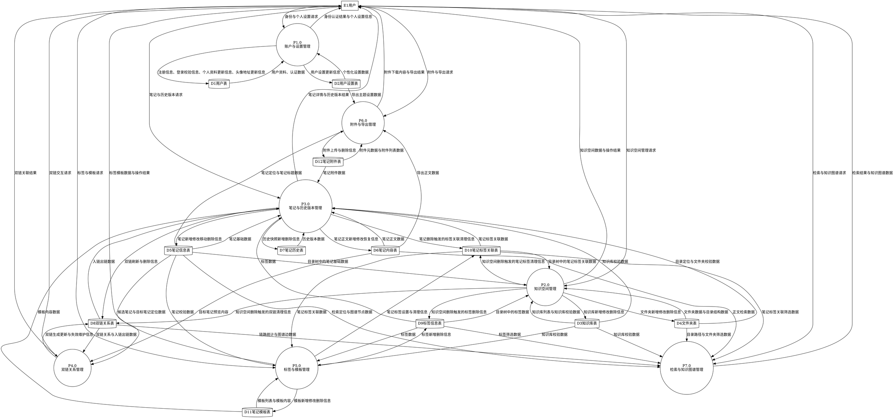

### 分图

**零层子图 1：账户与设置管理**

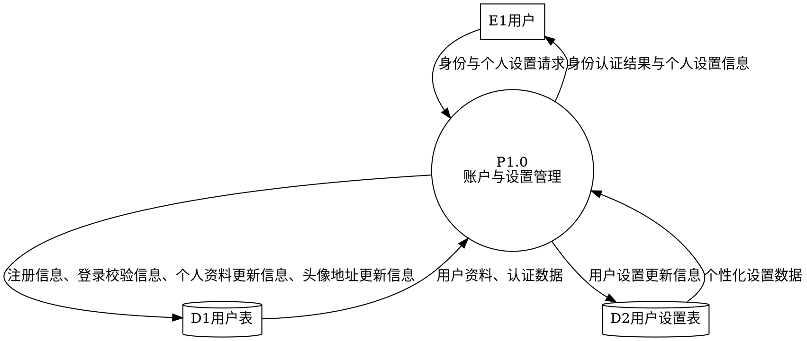

**零层子图 2：知识空间管理**

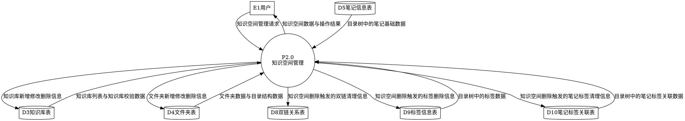

**零层子图 3：笔记与历史版本管理**

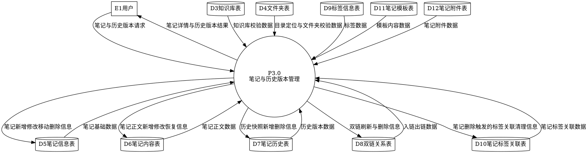

**零层子图 4：双链关系、检索与知识图谱管理**

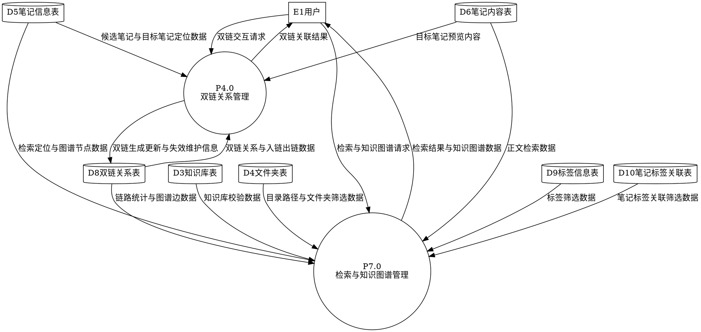

**零层子图 5：标签模板、附件与导出管理**

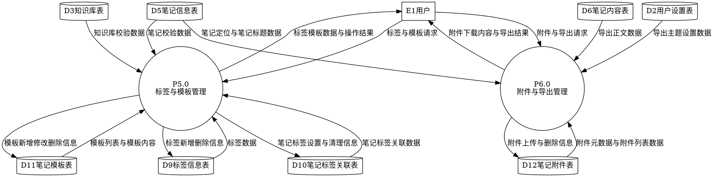

## 一层

### **一层数据流图：P1.0账户与设置管理**

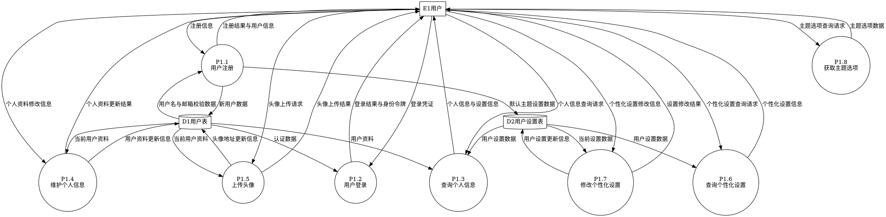

### **一层数据流图：P2.0知识空间管理**

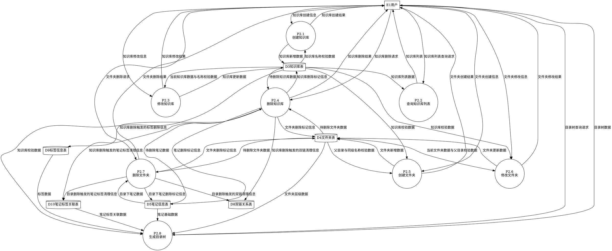

#### 分图版

分图 1：知识库管理

```
digraph "分图1_知识库管理" {
  e1 [shape=box, label="E1用户"];

  p21 [shape=circle, label="P2.1\n创建知识库"];
  p22 [shape=circle, label="P2.2\n查询知识库列表"];
  p23 [shape=circle, label="P2.3\n修改知识库"];
  p24 [shape=circle, label="P2.4\n删除知识库"];

  d3 [shape=cylinder, label="D3知识库表"];
  d4 [shape=cylinder, label="D4文件夹表"];
  d5 [shape=cylinder, label="D5笔记信息表"];
  d8 [shape=cylinder, label="D8双链关系表"];
  d9 [shape=cylinder, label="D9标签信息表"];
  d10 [shape=cylinder, label="D10笔记标签关联表"];

  e1 -> p21 [label="知识库创建信息"];
  d3 -> p21 [label="知识库名称校验数据"];
  p21 -> d3 [label="知识库新增数据"];
  p21 -> e1 [label="知识库创建结果"];

  e1 -> p22 [label="知识库列表查询请求"];
  d3 -> p22 [label="知识库列表数据"];
  p22 -> e1 [label="知识库列表"];

  e1 -> p23 [label="知识库修改信息"];
  d3 -> p23 [label="当前知识库数据与名称校验数据"];
  p23 -> d3 [label="知识库更新数据"];
  p23 -> e1 [label="知识库修改结果"];

  e1 -> p24 [label="知识库删除请求"];
  d3 -> p24 [label="待删除知识库数据"];
  d4 -> p24 [label="待删除文件夹数据"];
  d5 -> p24 [label="待删除笔记数据"];
  p24 -> d3 [label="知识库删除标记信息"];
  p24 -> d4 [label="文件夹删除标记信息"];
  p24 -> d5 [label="笔记删除标记信息"];
  p24 -> d8 [label="知识库删除触发的双链清理信息"];
  p24 -> d9 [label="知识库删除触发的标签删除信息"];
  p24 -> d10 [label="知识库删除触发的笔记标签清理信息"];
  p24 -> e1 [label="知识库删除结果"];
}

```

分图 2：文件夹管理

```
digraph "分图2_文件夹管理" {
  e1 [shape=box, label="E1用户"];

  p25 [shape=circle, label="P2.5\n创建文件夹"];
  p26 [shape=circle, label="P2.6\n修改文件夹"];
  p27 [shape=circle, label="P2.7\n删除文件夹"];

  d3 [shape=cylinder, label="D3知识库表"];
  d4 [shape=cylinder, label="D4文件夹表"];
  d5 [shape=cylinder, label="D5笔记信息表"];
  d8 [shape=cylinder, label="D8双链关系表"];
  d10 [shape=cylinder, label="D10笔记标签关联表"];

  e1 -> p25 [label="文件夹创建信息"];
  d3 -> p25 [label="知识库校验数据"];
  d4 -> p25 [label="父目录与同级名称校验数据"];
  p25 -> d4 [label="文件夹新增数据"];
  p25 -> e1 [label="文件夹创建结果"];

  e1 -> p26 [label="文件夹修改信息"];
  d3 -> p26 [label="知识库校验数据"];
  d4 -> p26 [label="当前文件夹数据与父目录校验数据"];
  p26 -> d4 [label="文件夹更新数据"];
  p26 -> e1 [label="文件夹修改结果"];

  e1 -> p27 [label="文件夹删除请求"];
  d4 -> p27 [label="待删除文件夹数据"];
  d5 -> p27 [label="目录下笔记数据"];
  p27 -> d4 [label="文件夹删除标记信息"];
  p27 -> d5 [label="目录下笔记删除标记信息"];
  p27 -> d8 [label="目录删除触发的双链清理信息"];
  p27 -> d10 [label="目录删除触发的笔记标签清理信息"];
  p27 -> e1 [label="文件夹删除结果"];
}

```

分图 3：目录树生成

```
digraph "分图3_目录树生成" {
  e1 [shape=box, label="E1用户"];

  p28 [shape=circle, label="P2.8\n生成目录树"];

  d3 [shape=cylinder, label="D3知识库表"];
  d4 [shape=cylinder, label="D4文件夹表"];
  d5 [shape=cylinder, label="D5笔记信息表"];
  d9 [shape=cylinder, label="D9标签信息表"];
  d10 [shape=cylinder, label="D10笔记标签关联表"];

  e1 -> p28 [label="目录树查询请求"];
  d3 -> p28 [label="知识库校验数据"];
  d4 -> p28 [label="文件夹层级数据"];
  d5 -> p28 [label="笔记基础数据"];
  d9 -> p28 [label="标签数据"];
  d10 -> p28 [label="笔记标签关联数据"];
  p28 -> e1 [label="目录树数据"];
}

```

### **一层数据流图：P3.0笔记与历史版本管理**

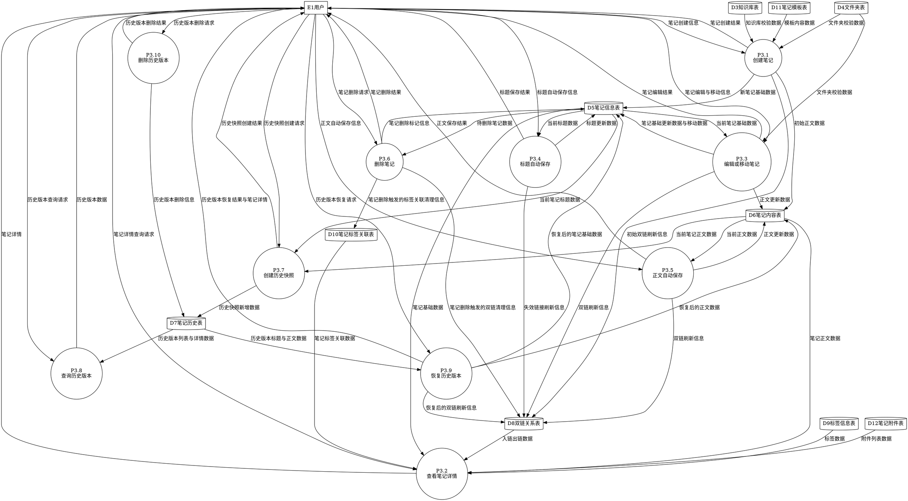

#### 分图版

分图 1：笔记创建与查看

```
digraph "分图1_笔记创建与查看" {
  e1 [shape=box, label="E1用户"];

  p31 [shape=circle, label="P3.1\n创建笔记"];
  p32 [shape=circle, label="P3.2\n查看笔记详情"];

  d3 [shape=cylinder, label="D3知识库表"];
  d4 [shape=cylinder, label="D4文件夹表"];
  d5 [shape=cylinder, label="D5笔记信息表"];
  d6 [shape=cylinder, label="D6笔记内容表"];
  d8 [shape=cylinder, label="D8双链关系表"];
  d9 [shape=cylinder, label="D9标签信息表"];
  d10 [shape=cylinder, label="D10笔记标签关联表"];
  d11 [shape=cylinder, label="D11笔记模板表"];
  d12 [shape=cylinder, label="D12笔记附件表"];

  e1 -> p31 [label="笔记创建信息"];
  d3 -> p31 [label="知识库校验数据"];
  d4 -> p31 [label="文件夹校验数据"];
  d11 -> p31 [label="模板内容数据"];
  p31 -> d5 [label="新笔记基础数据"];
  p31 -> d6 [label="初始正文数据"];
  p31 -> d8 [label="初始双链刷新信息"];
  p31 -> e1 [label="笔记创建结果"];

  e1 -> p32 [label="笔记详情查询请求"];
  d5 -> p32 [label="笔记基础数据"];
  d6 -> p32 [label="笔记正文数据"];
  d8 -> p32 [label="入链出链数据"];
  d9 -> p32 [label="标签数据"];
  d10 -> p32 [label="笔记标签关联数据"];
  d12 -> p32 [label="附件列表数据"];
  p32 -> e1 [label="笔记详情"];
}

```

分图 2：笔记编辑、自动保存与删除

```
digraph "分图2_笔记编辑自动保存与删除" {
  e1 [shape=box, label="E1用户"];

  p33 [shape=circle, label="P3.3\n编辑或移动笔记"];
  p34 [shape=circle, label="P3.4\n标题自动保存"];
  p35 [shape=circle, label="P3.5\n正文自动保存"];
  p36 [shape=circle, label="P3.6\n删除笔记"];

  d4 [shape=cylinder, label="D4文件夹表"];
  d5 [shape=cylinder, label="D5笔记信息表"];
  d6 [shape=cylinder, label="D6笔记内容表"];
  d8 [shape=cylinder, label="D8双链关系表"];
  d10 [shape=cylinder, label="D10笔记标签关联表"];

  e1 -> p33 [label="笔记编辑与移动信息"];
  d4 -> p33 [label="文件夹校验数据"];
  d5 -> p33 [label="当前笔记基础数据"];
  p33 -> d5 [label="笔记基础更新数据与移动数据"];
  p33 -> d6 [label="正文更新数据"];
  p33 -> d8 [label="双链刷新信息"];
  p33 -> e1 [label="笔记编辑结果"];

  e1 -> p34 [label="标题自动保存信息"];
  d5 -> p34 [label="当前标题数据"];
  p34 -> d5 [label="标题更新数据"];
  p34 -> d8 [label="失效链接刷新信息"];
  p34 -> e1 [label="标题保存结果"];

  e1 -> p35 [label="正文自动保存信息"];
  d6 -> p35 [label="当前正文数据"];
  p35 -> d6 [label="正文更新数据"];
  p35 -> d8 [label="双链刷新信息"];
  p35 -> e1 [label="正文保存结果"];

  e1 -> p36 [label="笔记删除请求"];
  d5 -> p36 [label="待删除笔记数据"];
  p36 -> d5 [label="笔记删除标记信息"];
  p36 -> d8 [label="笔记删除触发的双链清理信息"];
  p36 -> d10 [label="笔记删除触发的标签关联清理信息"];
  p36 -> e1 [label="笔记删除结果"];
}

```

分图 3：历史版本管理

```
digraph "分图3_历史版本管理" {
  e1 [shape=box, label="E1用户"];

  p37 [shape=circle, label="P3.7\n创建历史快照"];
  p38 [shape=circle, label="P3.8\n查询历史版本"];
  p39 [shape=circle, label="P3.9\n恢复历史版本"];
  p310 [shape=circle, label="P3.10\n删除历史版本"];

  d5 [shape=cylinder, label="D5笔记信息表"];
  d6 [shape=cylinder, label="D6笔记内容表"];
  d7 [shape=cylinder, label="D7笔记历史表"];
  d8 [shape=cylinder, label="D8双链关系表"];

  e1 -> p37 [label="历史快照创建请求"];
  d5 -> p37 [label="当前笔记标题数据"];
  d6 -> p37 [label="当前笔记正文数据"];
  p37 -> d7 [label="历史快照新增数据"];
  p37 -> e1 [label="历史快照创建结果"];

  e1 -> p38 [label="历史版本查询请求"];
  d7 -> p38 [label="历史版本列表与详情数据"];
  p38 -> e1 [label="历史版本数据"];

  e1 -> p39 [label="历史版本恢复请求"];
  d7 -> p39 [label="历史版本标题与正文数据"];
  p39 -> d5 [label="恢复后的笔记基础数据"];
  p39 -> d6 [label="恢复后的正文数据"];
  p39 -> d8 [label="恢复后的双链刷新信息"];
  p39 -> e1 [label="历史版本恢复结果与笔记详情"];

  e1 -> p310 [label="历史版本删除请求"];
  p310 -> d7 [label="历史版本删除信息"];
  p310 -> e1 [label="历史版本删除结果"];
}

```

### **一层数据流图：P4.0双链关系管理**

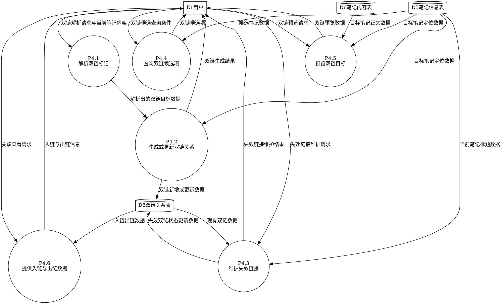

### **一层数据流图：P5.0标签与模板管理**

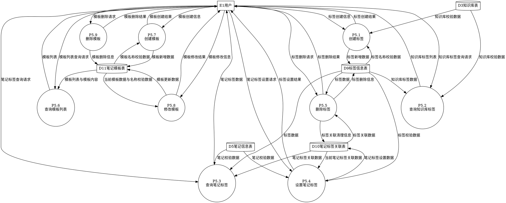

### **一层数据流图：P6.0附件与导出管理**

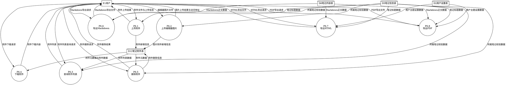

### **一层数据流图：P7.0检索与知识图谱管理**

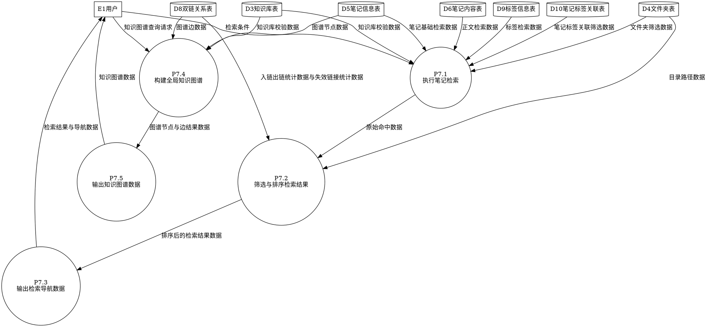
