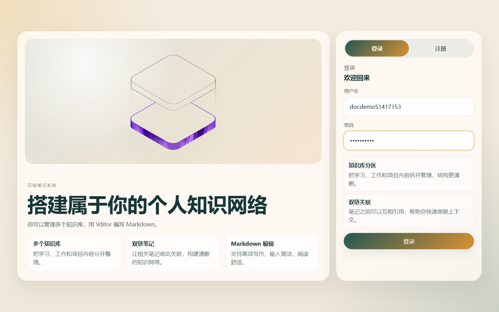
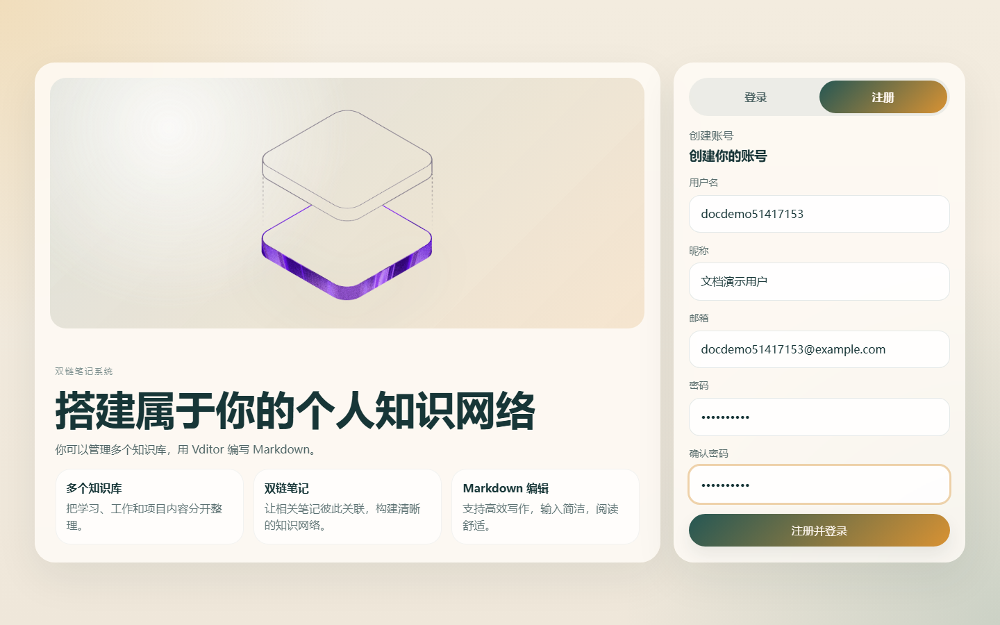
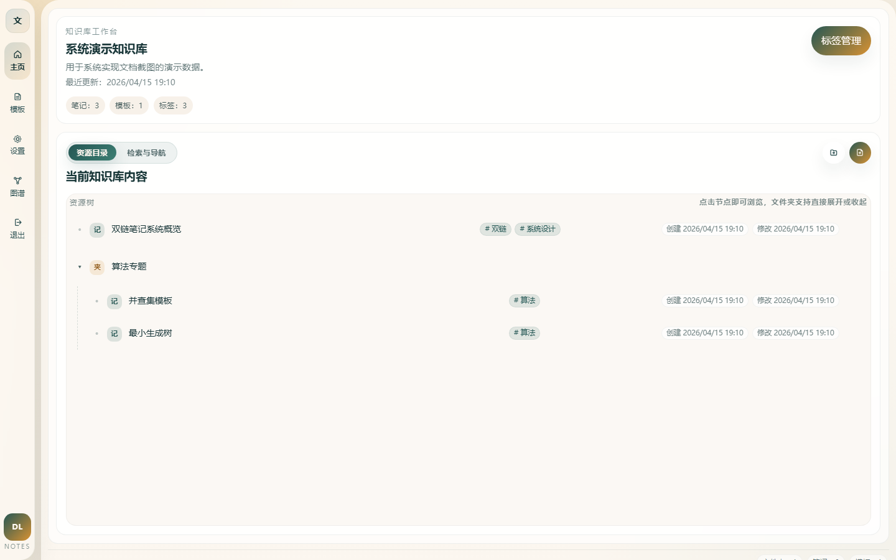
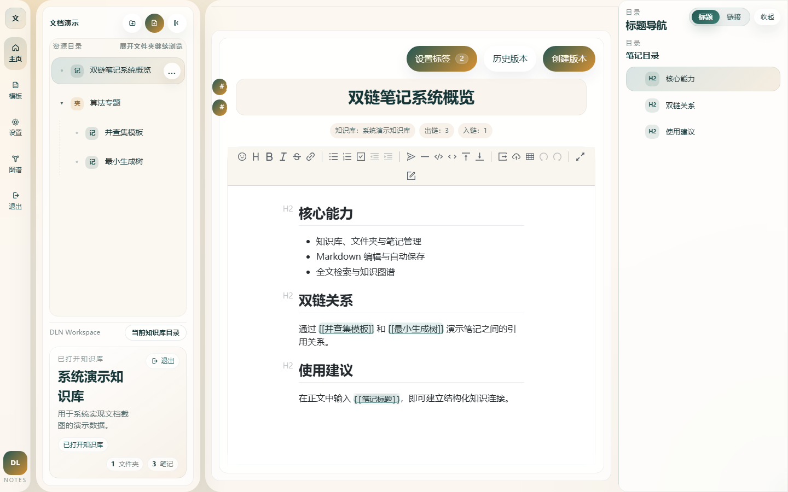
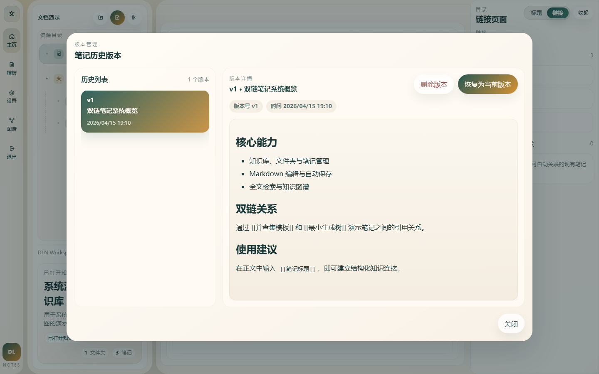
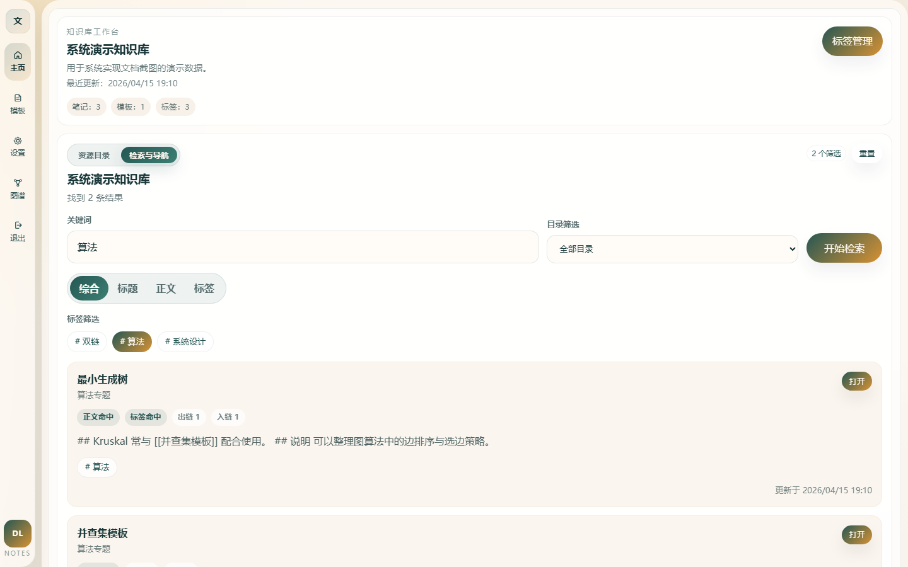
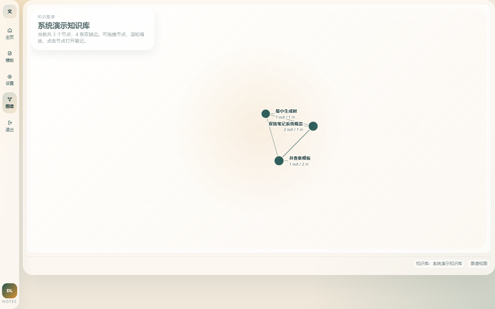
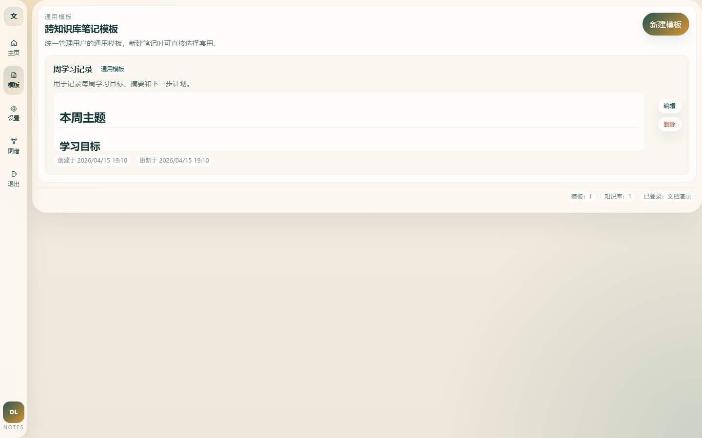
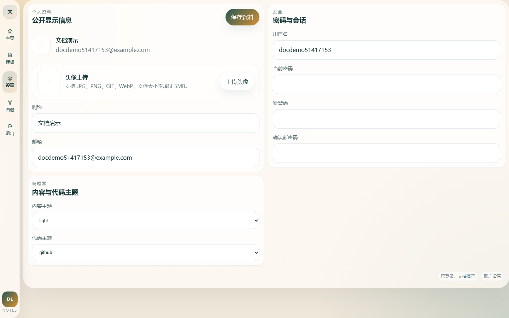

# 第6章 系统测试（含项目运行截图）

## 6.1 系统测试概述

在系统开发完成后，需要通过系统测试验证各核心功能模块是否满足预期要求。双链笔记系统包含用户认证、知识库管理、笔记编辑、双链关联、历史版本、检索导航、模板管理、知识图谱以及用户资料维护等功能。考虑到毕业设计测试章节的重点应放在主业务流程和核心功能闭环上，因此本章主要对登录注册、知识库与目录管理、笔记编辑与双链、检索与图谱、模板管理以及密码修改等核心模块进行测试，对于头像上传、附件上传等辅助性功能不再单独展开。

本次测试采用“浏览器界面验证 + 接口调用验证 + 项目运行结果截图佐证”相结合的方式进行。其中，登录、注册和密码确认类输入校验主要通过前端界面进行验证；知识库、笔记、双链、版本、检索、模板及密码修改等业务流程则通过后端接口与实际运行环境联合验证；各模块后附的页面截图用于展示系统在本地运行时的真实界面状态，从而使测试结果更具可见性和可信度。

## 6.2 测试环境与测试方法

本次系统测试所使用的软硬件环境如表 6-1 所示。

表 6-1 系统测试环境

| 类别 | 配置 |
| --- | --- |
| 操作系统 | Windows 11 |
| JDK 版本 | Java 17 |
| 后端框架 | Spring Boot 3.5.11 |
| 前端框架 | Vue 3 + TypeScript + Vite |
| 数据库 | MySQL 8.0.35 |
| 构建工具 | Maven 3.9.12、npm 10.9.2 |
| 浏览器测试方式 | 浏览器界面联调验证与运行截图采集 |
| 接口测试方式 | 本地运行接口调用验证 |
| 补充验证方式 | `mvn test`、`npm run build` |

测试过程中，前端运行地址为 `http://127.0.0.1:5173`，后端运行地址为 `http://127.0.0.1:8080`。截图均来自项目本地运行页面，测试文档中的“实际结果”以真实运行结果为依据，而非静态推断。

## 6.3 项目运行验证说明

为保证测试环境真实有效，在正式执行功能测试前，对项目运行状态进行了验证。根据已有运行日志可知，前端开发服务器于 2026 年 4 月 15 日 18:57:24 在 `http://127.0.0.1:5173/` 成功启动，后端服务于 2026 年 4 月 15 日 18:57:36 完成启动并监听 `8080` 端口，说明系统具备前后端联调运行条件。

此外，于 2026 年 4 月 16 日执行了补充验证。其中，前端执行 `npm run build` 构建成功，说明当前前端代码能够完成生产构建；后端执行 `mvn test` 时，`DlnApplicationTests` 通过，但 `TagServiceTest` 存在 1 项失败和 3 项错误，表明当前项目在单元测试层面仍有待进一步修正。由于本章重点围绕系统运行与核心业务流程测试展开，因此以下测试结论主要依据实际联调功能与运行截图进行说明，同时保留该补充结果作为项目当前状态说明。

## 6.4 用户认证模块测试

用户认证模块主要包括登录功能与注册功能。测试重点为输入项校验、账号密码正确性校验以及重复账号校验等内容。

### 6.4.1 登录功能测试

登录功能测试主要验证登录界面在空输入、错误密码和正确登录三种情况下的处理结果。针对该模块设计的测试用例及执行结果如表 6-2 所示。

表 6-2 登录功能测试用例表

| 测试用例 | 预期结果 | 实际结果 |
| --- | --- | --- |
| 用户名为空、密码为空 | 登录失败，提示“用户名和密码不能为空。” | 与预期结果一致 |
| 用户名正确、密码错误 | 登录失败，提示“用户名或密码错误” | 与预期结果一致 |
| 用户名正确、密码正确 | 登录成功，提示“登录成功” | 与预期结果一致 |

从测试结果可以看出，系统能够正确识别登录表单的空输入情况，并且能够对账号密码错误进行拦截。在输入正确的用户名和密码后，系统能够顺利完成登录，说明用户认证流程实现正确。图 6-1 给出了系统在实际运行测试过程中的登录页面截图。

图 6-1 登录功能运行测试截图

### 6.4.2 注册功能测试

注册功能测试主要包括注册输入项校验、密码一致性校验、重复账号校验以及正常注册流程验证。针对注册模块设计的测试用例及执行结果如表 6-3 所示。

表 6-3 注册功能测试用例表

| 测试用例 | 预期结果 | 实际结果 |
| --- | --- | --- |
| 仅输入用户名和密码，未填写昵称和邮箱 | 注册失败，提示“注册时请填写昵称和邮箱。” | 与预期结果一致 |
| 密码和确认密码不一致 | 注册失败，提示“两次输入的密码不一致。” | 与预期结果一致 |
| 输入已存在用户名，其余字段正确 | 注册失败，提示“用户名已存在” | 与预期结果一致 |
| 输入全新用户名且各字段正确 | 注册成功，提示“注册成功。” | 与预期结果一致 |

测试结果表明，系统在注册环节能够有效完成表单输入校验和重复账号检查，能够防止不完整注册和重复注册，并在输入合法时正确创建新用户。图 6-2 给出了注册页面的运行测试截图。

图 6-2 注册功能运行测试截图

## 6.5 知识库与目录管理模块测试

知识库与目录管理模块是系统组织知识内容的基础模块。该模块测试重点放在知识库创建、重复名称限制、知识库修改以及文件夹创建等关键流程。测试用例及执行结果如表 6-4 所示。

表 6-4 知识库与目录管理测试用例表

| 测试用例 | 预期结果 | 实际结果 |
| --- | --- | --- |
| 创建新的知识库 | 创建成功，返回“创建知识库成功” | 与预期结果一致 |
| 使用同一用户重复创建同名知识库 | 创建失败，提示“知识库名称已存在” | 与预期结果一致 |
| 修改已有知识库名称与描述 | 修改成功，返回“更新知识库成功” | 与预期结果一致 |
| 在知识库根目录下新建文件夹 | 创建成功，返回“创建文件夹成功” | 与预期结果一致 |

由测试结果可以看出，系统能够完成知识库及目录层级的基本管理，并且对重复名称具备有效约束，说明知识库与目录组织模块已经具备稳定运行能力。图 6-3 为知识库工作台与目录区域的运行测试截图，可用于直观展示该模块的实际界面效果。

图 6-3 知识库与目录管理运行测试截图

## 6.6 笔记编辑、双链与历史版本模块测试

笔记编辑模块是系统的核心业务模块，双链与历史版本则是系统区别于普通笔记管理系统的重要能力。因此，本节将三者作为一个完整业务链路进行联合测试。测试重点包括笔记创建、正文自动保存、双链关系生成、双链详情查询以及历史版本创建与查询。测试用例及执行结果如表 6-5 所示。

表 6-5 笔记编辑、双链与历史版本测试用例表

| 测试用例 | 预期结果 | 实际结果 |
| --- | --- | --- |
| 在知识库目录下创建笔记 A | 创建成功，返回“创建笔记成功” | 与预期结果一致 |
| 在知识库目录下创建笔记 B | 创建成功，返回“创建笔记成功” | 与预期结果一致 |
| 对笔记 A 执行正文自动保存 | 自动保存成功，返回“自动保存笔记正文成功” | 与预期结果一致 |
| 在笔记 A、B 正文中互相使用 `[[笔记标题]]` 建立引用 | 双链关系建立成功 | 与预期结果一致 |
| 查询笔记 A 详情 | 能正确返回入链与出链数据 | 与预期结果一致，查询结果为 `outgoing=1, incoming=1` |
| 对笔记 A 创建历史版本 | 历史版本创建成功，返回“创建历史版本成功” | 与预期结果一致 |
| 查询笔记 A 历史版本列表 | 能正确返回历史版本列表 | 与预期结果一致，查询结果为 `historyCount=1` |

测试结果说明，系统不仅能够完成笔记内容编辑和自动保存，还能够在正文保存过程中正确解析双链关系，并支持对笔记内容进行历史快照管理。这表明笔记模块核心业务流程已经形成闭环。图 6-4 和图 6-5 分别展示了笔记编辑界面与历史版本界面的运行测试截图。

图 6-4 笔记编辑与双链运行测试截图

图 6-5 历史版本运行测试截图

## 6.7 检索导航与知识图谱模块测试

随着知识库内容不断增加，检索与图谱功能对知识定位和结构理解具有重要意义。本节主要测试关键词检索和知识图谱数据生成两项核心能力。测试用例及执行结果如表 6-6 所示。

表 6-6 检索导航与知识图谱测试用例表

| 测试用例 | 预期结果 | 实际结果 |
| --- | --- | --- |
| 在知识库中使用关键词进行综合检索 | 能返回匹配笔记列表 | 与预期结果一致，检索结果为 `searchCount=2` |
| 请求当前知识库的图谱数据 | 能返回节点与边数据 | 与预期结果一致，图谱结果为 `nodes=2, edges=2` |

测试结果表明，系统已经能够基于知识库中的笔记与双链关系提供可用的检索和图谱数据，说明检索导航和知识结构可视化模块运行正常。图 6-6 和图 6-7 分别给出了检索界面与知识图谱界面的运行测试截图。

图 6-6 检索导航运行测试截图

图 6-7 知识图谱运行测试截图

## 6.8 模板管理模块测试

模板管理模块主要用于提高笔记创建效率，测试重点为模板创建和模板列表查询。测试用例及执行结果如表 6-7 所示。

表 6-7 模板管理测试用例表

| 测试用例 | 预期结果 | 实际结果 |
| --- | --- | --- |
| 新建通用笔记模板 | 创建成功，返回“创建模板成功” | 与预期结果一致 |
| 查询当前用户模板列表 | 能正确返回模板列表 | 与预期结果一致，查询结果为 `templateCount=1` |

测试结果表明，模板模块能够支持模板创建与读取，满足通用模板复用的基本设计目标。图 6-8 为模板管理界面的运行测试截图。

图 6-8 模板管理运行测试截图

## 6.9 用户资料与密码修改模块测试

用户资料与密码修改模块主要验证密码修改流程是否正确，包括前端确认密码一致性校验、原密码正确性校验以及新密码生效验证。测试用例及执行结果如表 6-8 所示。

表 6-8 用户资料与密码修改测试用例表

| 测试用例 | 预期结果 | 实际结果 |
| --- | --- | --- |
| 新密码与确认密码不一致 | 修改失败，提示“两次输入的新密码不一致。” | 与预期结果一致 |
| 原密码错误，其他字段正确 | 修改失败，提示“当前密码错误” | 与预期结果一致 |
| 原密码正确，输入新的合法密码 | 修改成功，返回“用户信息更新成功” | 与预期结果一致 |
| 使用新密码重新登录 | 登录成功，说明新密码已生效 | 与预期结果一致 |

测试结果说明，系统能够正确识别密码修改过程中的输入错误和原密码错误情况，并且在输入正确信息时能够完成密码更新，随后可使用新密码重新登录，说明密码修改流程实现正确。图 6-9 为用户设置与密码修改界面的运行测试截图。

图 6-9 用户资料与密码修改运行测试截图

## 6.10 补充运行验证结果

除上述核心业务流程测试外，还对项目当前工程状态进行了补充验证，结果如下：

1. 前端于 2026 年 4 月 16 日执行 `npm run build` 成功，说明当前前端项目可以完成生产环境构建。
2. 后端于 2026 年 4 月 16 日执行 `mvn test` 时，共运行 7 项测试，其中 `DlnApplicationTests` 通过，`TagServiceTest` 中存在 1 项失败和 3 项错误。
3. 从补充验证结果来看，当前系统的前后端运行链路与页面展示基本正常，但后端标签服务相关单元测试仍需继续修正，以进一步提升工程质量与回归测试稳定性。

因此，在论文或答辩材料中，可将本章截图和功能联调结果作为“系统已完成核心业务闭环验证”的主要依据，同时在项目总结中补充说明自动化单元测试仍存在待完善项，使结论更加严谨。

## 6.11 测试结果分析

综合上述测试结果可以看出，双链笔记系统的核心功能模块已经通过验证，主要表现如下：

1. 用户认证模块能够正确完成登录、注册、重复账号校验和密码错误拦截。
2. 知识库与目录管理模块能够正常完成知识库创建、修改和目录组织操作。
3. 笔记编辑模块能够完成笔记创建与正文自动保存，并在保存过程中建立双链关系。
4. 历史版本模块能够为笔记创建和查询版本快照。
5. 检索导航与知识图谱模块能够返回正确的检索结果和图谱数据。
6. 模板管理模块能够支持模板创建与模板列表读取。
7. 用户资料与密码修改模块能够完成密码一致性校验、原密码校验和新密码生效验证。

本次测试主要围绕核心业务链路展开，功能联调结果均与预期结果一致，说明当前系统已经具备较好的可用性和稳定性，能够满足个人双链笔记管理场景下的基本应用需求。与此同时，补充运行验证也表明项目在单元测试层面仍存在一定完善空间，后续可继续围绕标签服务相关逻辑补充修复与回归验证。

## 6.12 本章小结

本章对双链笔记系统的核心功能模块进行了系统测试，测试内容涵盖了用户认证、知识库与目录管理、笔记编辑、双链关系、历史版本、检索导航、知识图谱、模板管理以及密码修改等关键流程，并补充给出了系统运行截图和工程验证结果。

总体来看，当前系统主要功能均能够按照设计要求正常运行，关键业务流程闭环完整，已经具备进入论文总结与后续完善分析阶段的基础。但从项目工程质量角度看，自动化单元测试仍需进一步修正和补强，以保证系统后续演进时具备更稳定的回归验证能力。
