# 第6章 系统测试（逐用例运行截图版）

## 6.1 系统测试概述

在系统开发完成后，需要通过系统测试验证各核心功能模块是否满足预期要求。双链笔记系统包含用户认证、知识库管理、笔记编辑、双链关联、历史版本、检索导航、模板管理、知识图谱以及用户资料维护等功能。考虑到毕业设计测试章节的重点应放在主业务流程和核心功能闭环上，因此本章主要对登录注册、知识库与目录管理、笔记编辑与双链、检索与图谱、模板管理以及密码修改等核心模块进行测试。

与上一版测试文档不同，本版文档按照“一个测试用例对应一张实际运行截图”的方式编写。截图来源包括两类：一类为项目运行页面截图，主要用于登录、注册、知识库管理、模板管理、检索、图谱和设置等界面型用例；另一类为接口运行结果截图，主要用于正文自动保存这类前端无独立提示、但可通过接口返回结果直观佐证的用例。

## 6.2 测试环境与测试方法

本次系统测试所使用的软硬件环境如表 6-1 所示。

表 6-1 系统测试环境

| 类别 | 配置 |
| --- | --- |
| 操作系统 | Windows 11 |
| JDK 版本 | Java 17 |
| 后端框架 | Spring Boot 3.5.11 |
| 前端框架 | Vue 3 + TypeScript + Vite |
| 数据库 | MySQL 8.0.35 |
| 构建工具 | Maven 3.9.12、npm 10.9.2 |
| 前端运行地址 | `http://127.0.0.1:5173` |
| 后端运行地址 | `http://127.0.0.1:8080` |
| 页面截图方式 | 浏览器实际运行截图 |
| 接口截图方式 | 本地运行接口结果截图 |

本次截图采集于 2026 年 4 月 16 日完成，共生成 26 张逐用例截图，对应原测试文档中的 26 个测试用例。

## 6.3 用户认证模块测试

用户认证模块主要包括登录功能与注册功能。测试重点为输入项校验、账号密码正确性校验以及重复账号校验等内容。

6.3.1 登录功能测试

表 6-2 登录功能测试用例表

| 测试用例 | 预期结果 | 实际结果 |
| --- | --- | --- |
| 用户名为空、密码为空 | 登录失败，提示“用户名和密码不能为空。” | 与预期结果一致 |
| 用户名正确、密码错误 | 登录失败，提示“用户名或密码错误” | 与预期结果一致 |
| 用户名正确、密码正确 | 登录成功，提示“登录成功” | 与预期结果一致 |

用例 6-2-1 用户名为空、密码为空。

预期结果：登录失败，系统提示用户名和密码不能为空。  
实际结果：前端页面出现错误提示，与预期一致。

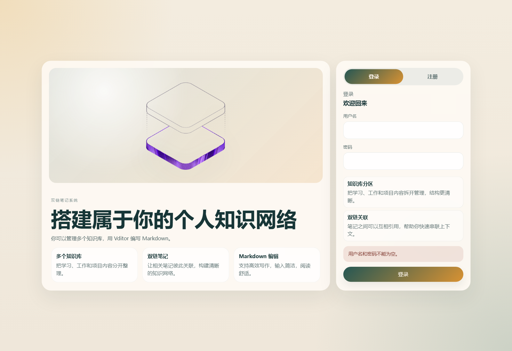

图 6-1 登录空输入运行截图

用例 6-2-2 用户名正确、密码错误。

预期结果：登录失败，系统提示用户名或密码错误。  
实际结果：前端页面出现错误提示，与预期一致。

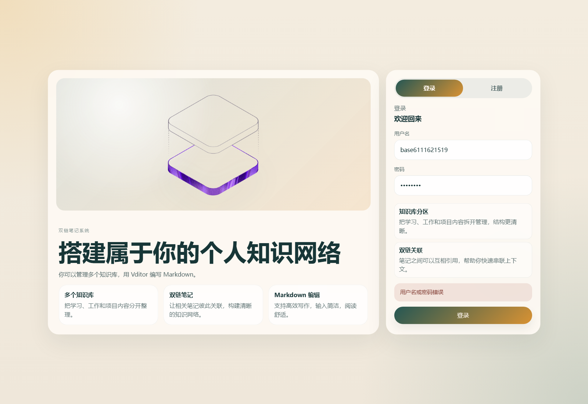

图 6-2 登录错误密码运行截图

用例 6-2-3 用户名正确、密码正确。

预期结果：登录成功并进入系统主页。  
实际结果：页面成功进入系统工作台，与预期一致。

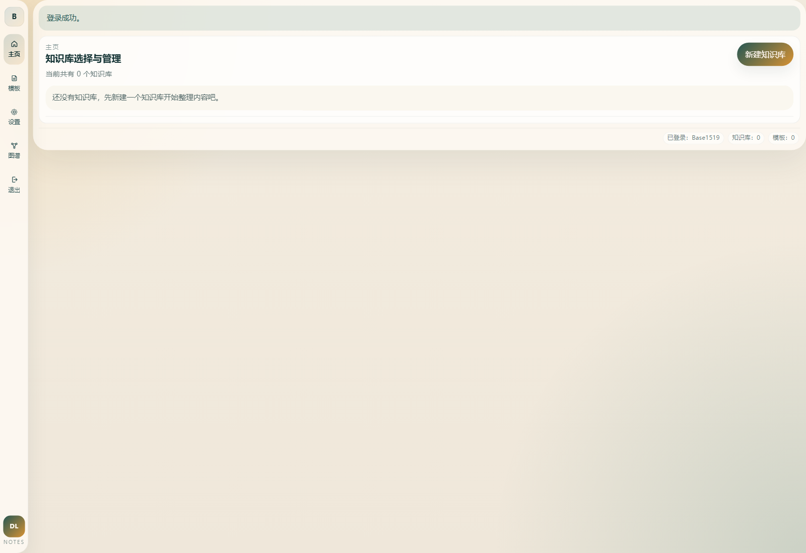

图 6-3 登录成功运行截图

6.3.2 注册功能测试

表 6-3 注册功能测试用例表

| 测试用例 | 预期结果 | 实际结果 |
| --- | --- | --- |
| 仅输入用户名和密码，未填写昵称和邮箱 | 注册失败，提示“注册时请填写昵称和邮箱。” | 与预期结果一致 |
| 密码和确认密码不一致 | 注册失败，提示“两次输入的密码不一致。” | 与预期结果一致 |
| 输入已存在用户名，其余字段正确 | 注册失败，提示“用户名已存在” | 与预期结果一致 |
| 输入全新用户名且各字段正确 | 注册成功，提示“注册成功。” | 与预期结果一致 |

用例 6-3-1 缺少昵称和邮箱。

预期结果：注册失败，系统提示需补全昵称和邮箱。  
实际结果：前端页面出现错误提示，与预期一致。

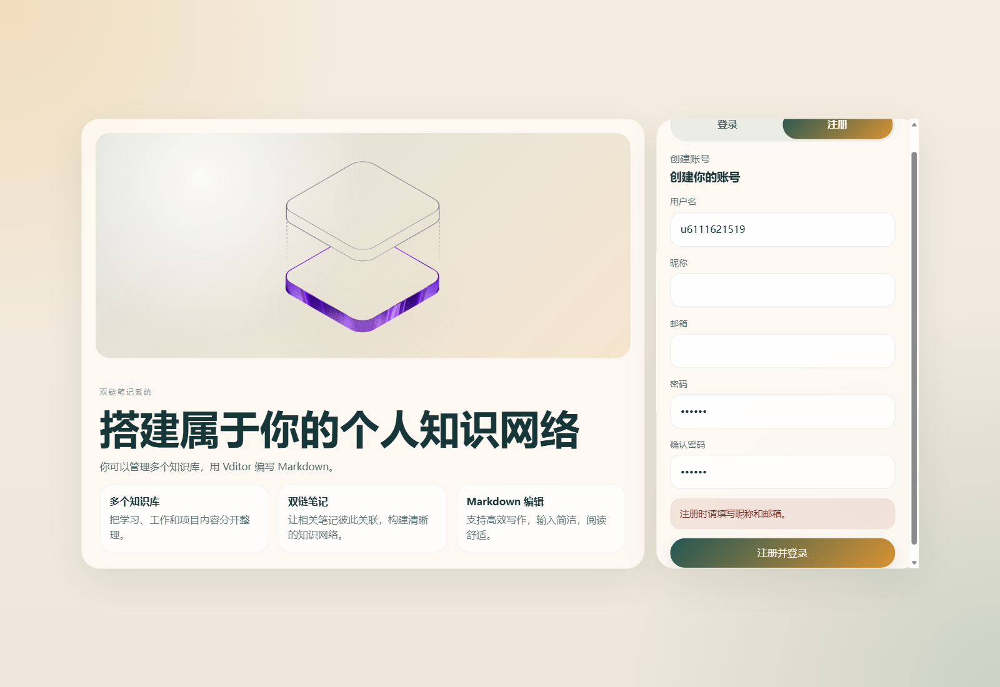

图 6-4 注册缺少必填项运行截图

用例 6-3-2 两次输入密码不一致。

预期结果：注册失败，系统提示两次密码不一致。  
实际结果：前端页面出现错误提示，与预期一致。

图 6-5 注册密码不一致运行截图

用例 6-3-3 注册重复用户名。

预期结果：注册失败，系统提示用户名已存在。  
实际结果：前端页面出现错误提示，与预期一致。

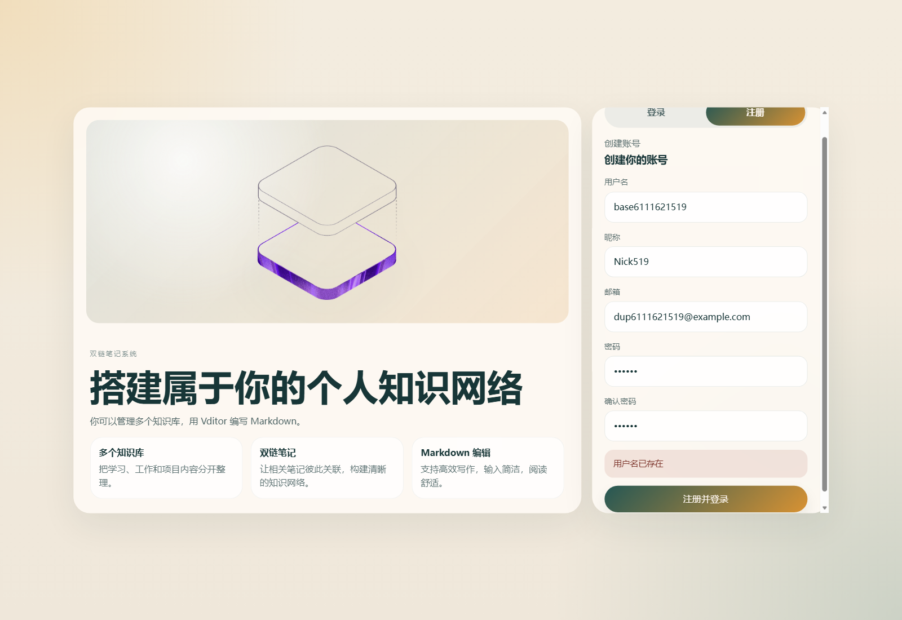

图 6-6 注册重复用户名运行截图

用例 6-3-4 新用户注册成功。

预期结果：注册成功并自动进入系统主页。  
实际结果：页面成功进入系统工作台，与预期一致。

图 6-7 注册成功运行截图

## 6.4 知识库与目录管理模块测试

知识库与目录管理模块是系统组织知识内容的基础模块。测试重点放在知识库创建、重复名称限制、知识库修改以及文件夹创建等关键流程。

表 6-4 知识库与目录管理测试用例表

| 测试用例 | 预期结果 | 实际结果 |
| --- | --- | --- |
| 创建新的知识库 | 创建成功，返回“创建知识库成功” | 与预期结果一致 |
| 使用同一用户重复创建同名知识库 | 创建失败，提示“知识库名称已存在” | 与预期结果一致 |
| 修改已有知识库名称与描述 | 修改成功，返回“更新知识库成功” | 与预期结果一致 |
| 在知识库根目录下新建文件夹 | 创建成功，返回“创建文件夹成功” | 与预期结果一致 |

用例 6-4-1 创建新的知识库。

预期结果：知识库创建成功。  
实际结果：页面进入新知识库工作台，并显示创建成功提示。

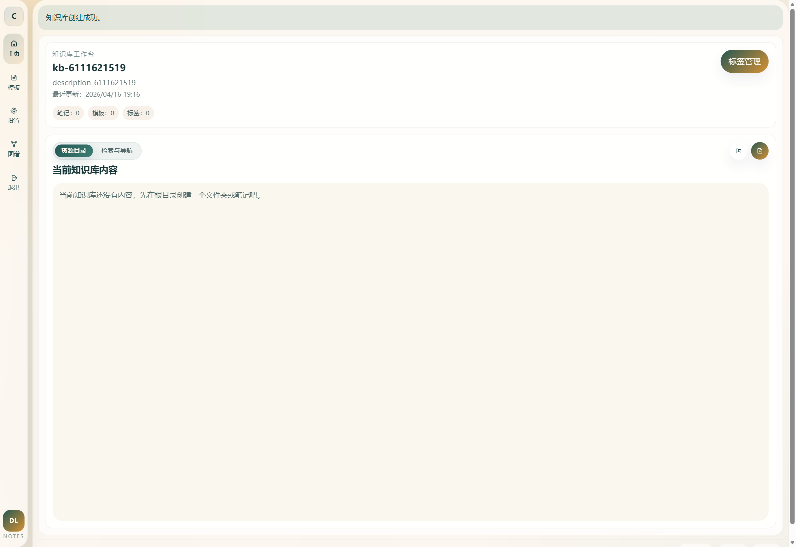

图 6-8 创建知识库运行截图

用例 6-4-2 重复创建同名知识库。

预期结果：系统拦截重复名称并提示错误。  
实际结果：页面弹窗保留，顶部出现“知识库名称已存在”提示，与预期一致。

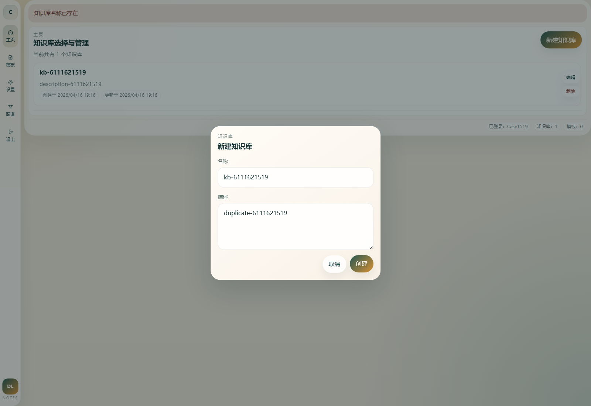

图 6-9 重复创建知识库运行截图

用例 6-4-3 修改知识库名称与描述。

预期结果：知识库信息更新成功。  
实际结果：页面显示更新后的知识库名称与描述，并提示更新成功。

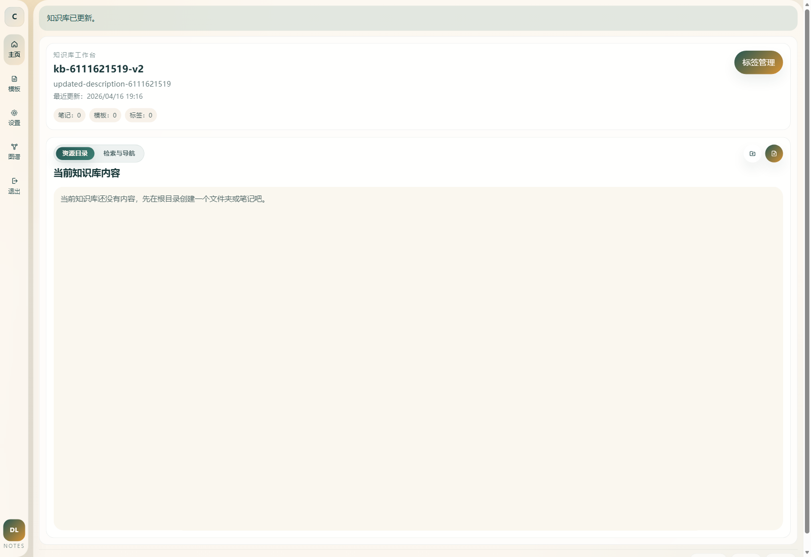

图 6-10 更新知识库运行截图

用例 6-4-4 在根目录下创建文件夹。

预期结果：文件夹创建成功并出现在目录结构中。  
实际结果：页面目录区出现新建文件夹，与预期一致。

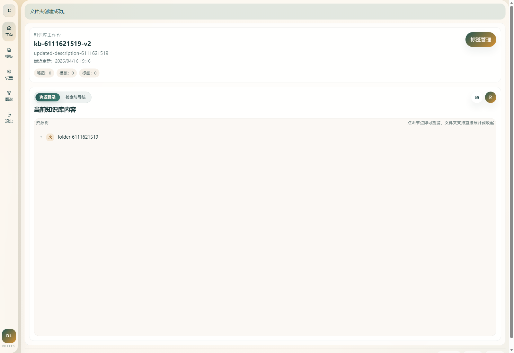

图 6-11 创建文件夹运行截图

## 6.5 笔记编辑、双链与历史版本模块测试

笔记编辑模块是系统的核心业务模块，双链与历史版本则是系统区别于普通笔记管理系统的重要能力。因此，本节将三者作为一个完整业务链路进行联合测试。

表 6-5 笔记编辑、双链与历史版本测试用例表

| 测试用例 | 预期结果 | 实际结果 |
| --- | --- | --- |
| 在知识库目录下创建笔记 A | 创建成功，返回“创建笔记成功” | 与预期结果一致 |
| 在知识库目录下创建笔记 B | 创建成功，返回“创建笔记成功” | 与预期结果一致 |
| 对笔记 A 执行正文自动保存 | 自动保存成功，返回“自动保存笔记正文成功” | 与预期结果一致 |
| 在笔记 A、B 正文中互相使用 `[[笔记标题]]` 建立引用 | 双链关系建立成功 | 与预期结果一致 |
| 查询笔记 A 详情 | 能正确返回入链与出链数据 | 与预期结果一致 |
| 对笔记 A 创建历史版本 | 历史版本创建成功，返回“创建历史版本成功” | 与预期结果一致 |
| 查询笔记 A 历史版本列表 | 能正确返回历史版本列表 | 与预期结果一致 |

用例 6-5-1 创建笔记 A。

预期结果：笔记 A 创建成功并进入笔记页面。  
实际结果：页面显示笔记 A 标题，并提示笔记创建成功。

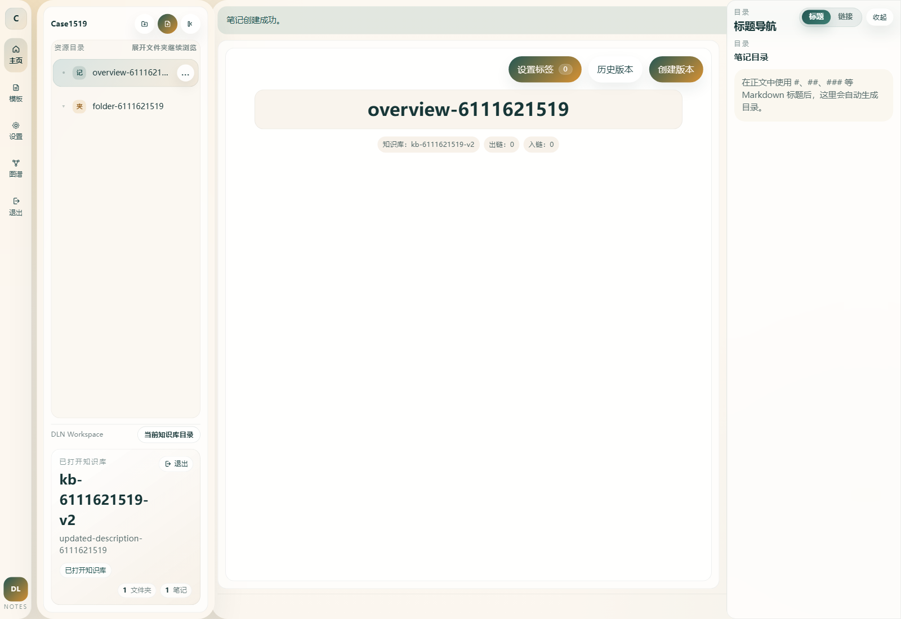

图 6-12 创建笔记 A 运行截图

用例 6-5-2 创建笔记 B。

预期结果：笔记 B 创建成功并进入笔记页面。  
实际结果：页面显示笔记 B 标题，并提示笔记创建成功。

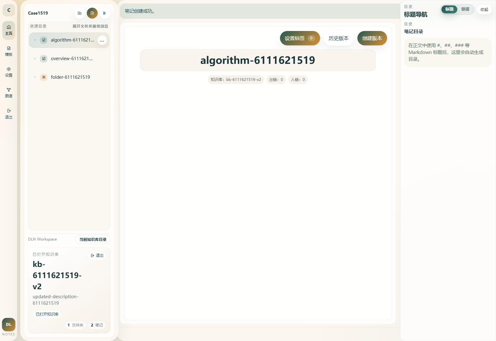

图 6-13 创建笔记 B 运行截图

用例 6-5-3 笔记正文自动保存。

预期结果：正文自动保存接口返回成功结果。  
实际结果：接口实际运行成功，返回“自动保存笔记正文成功”。

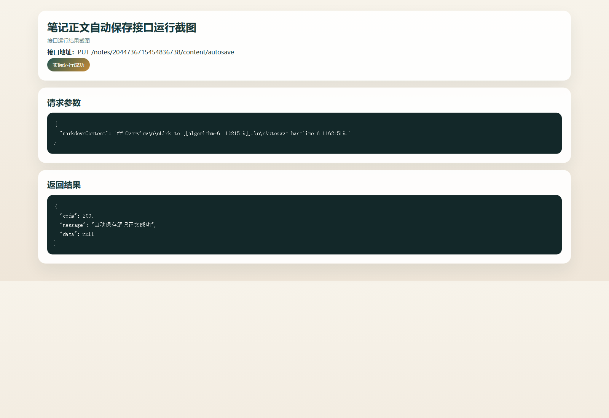

图 6-14 笔记正文自动保存接口运行截图

用例 6-5-4 建立双链引用关系。

预期结果：笔记 A 与笔记 B 间成功建立双链关系。  
实际结果：打开笔记页面后，系统已根据引用关系完成双链建立。

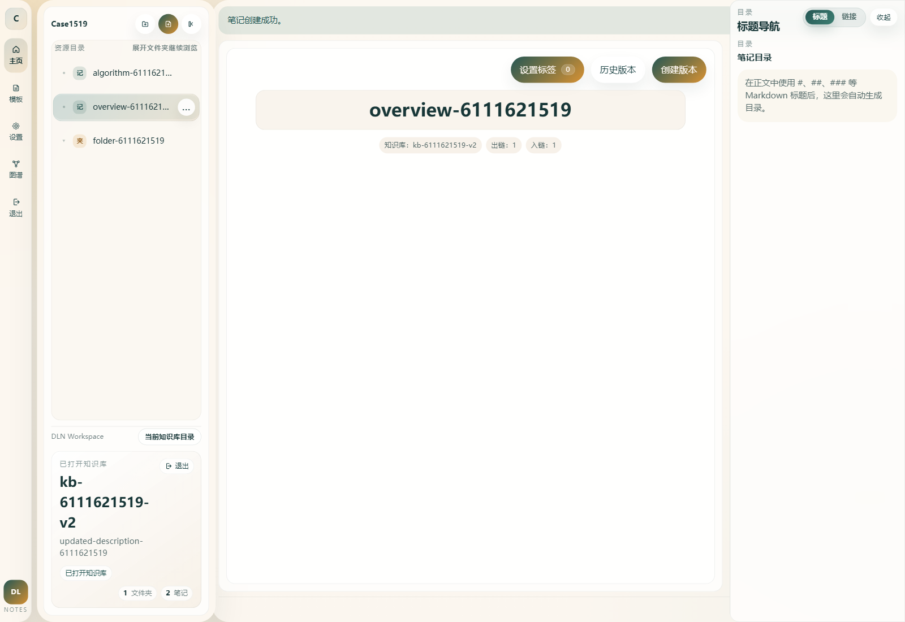

图 6-15 双链关系建立运行截图

用例 6-5-5 查询笔记 A 详情。

预期结果：页面可正确展示笔记 A 的入链与出链信息。  
实际结果：右侧链接面板可见链接相关信息，与预期一致。

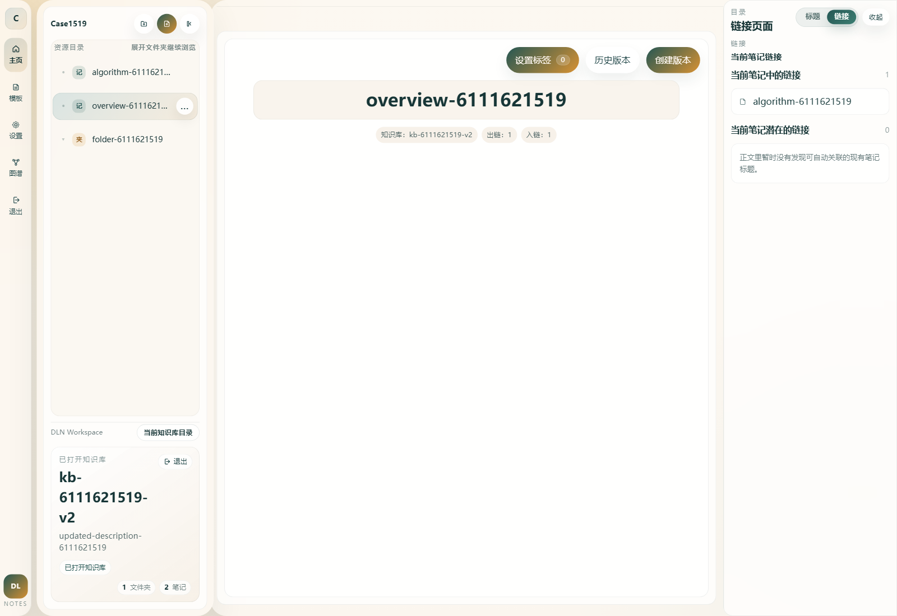

图 6-16 查询笔记详情运行截图

用例 6-5-6 创建历史版本。

预期结果：历史版本创建成功。  
实际结果：页面出现创建成功提示，与预期一致。

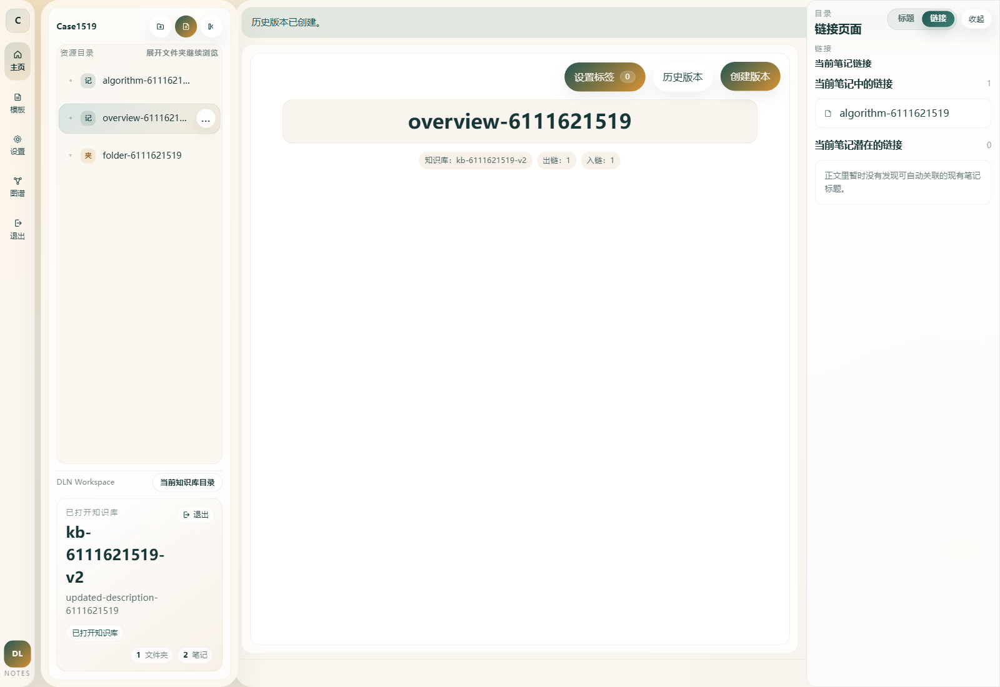

图 6-17 创建历史版本运行截图

用例 6-5-7 查询历史版本列表。

预期结果：能够正确展示历史版本列表。  
实际结果：历史版本弹窗成功打开，并展示版本列表与详情。

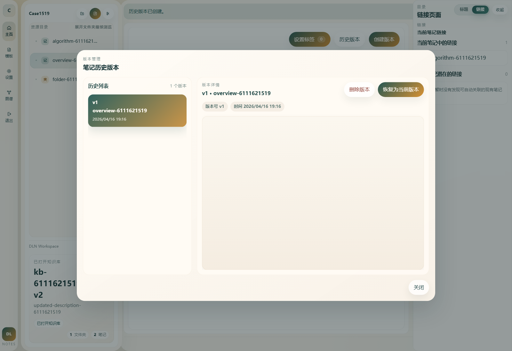

图 6-18 查询历史版本列表运行截图

## 6.6 检索导航与知识图谱模块测试

随着知识库内容不断增加，检索与图谱功能对知识定位和结构理解具有重要意义。本节主要测试关键词检索和知识图谱数据生成两项核心能力。

表 6-6 检索导航与知识图谱测试用例表

| 测试用例 | 预期结果 | 实际结果 |
| --- | --- | --- |
| 在知识库中使用关键词进行综合检索 | 能返回匹配笔记列表 | 与预期结果一致 |
| 请求当前知识库的图谱数据 | 能返回节点与边数据 | 与预期结果一致 |

用例 6-6-1 关键词检索。

预期结果：检索页面返回与关键词匹配的笔记列表。  
实际结果：搜索结果区域成功显示匹配笔记，与预期一致。

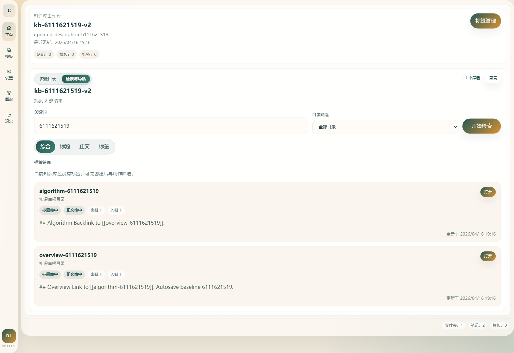

图 6-19 关键词检索运行截图

用例 6-6-2 知识图谱数据生成。

预期结果：知识图谱页面正确渲染节点与边。  
实际结果：图谱页面成功展示知识节点及连接关系，与预期一致。

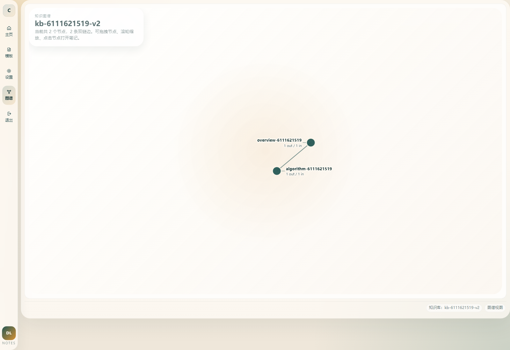

图 6-20 知识图谱运行截图

## 6.7 模板管理模块测试

模板管理模块主要用于提高笔记创建效率，测试重点为模板创建和模板列表查询。

表 6-7 模板管理测试用例表

| 测试用例 | 预期结果 | 实际结果 |
| --- | --- | --- |
| 新建通用笔记模板 | 创建成功，返回“创建模板成功” | 与预期结果一致 |
| 查询当前用户模板列表 | 能正确返回模板列表 | 与预期结果一致 |

用例 6-7-1 创建模板。

预期结果：模板创建成功。  
实际结果：模板列表页面新增目标模板，并显示创建成功提示。

图 6-21 创建模板运行截图

用例 6-7-2 查询模板列表。

预期结果：模板列表能够正确展示当前模板数据。  
实际结果：模板列表页面成功显示新建模板，与预期一致。

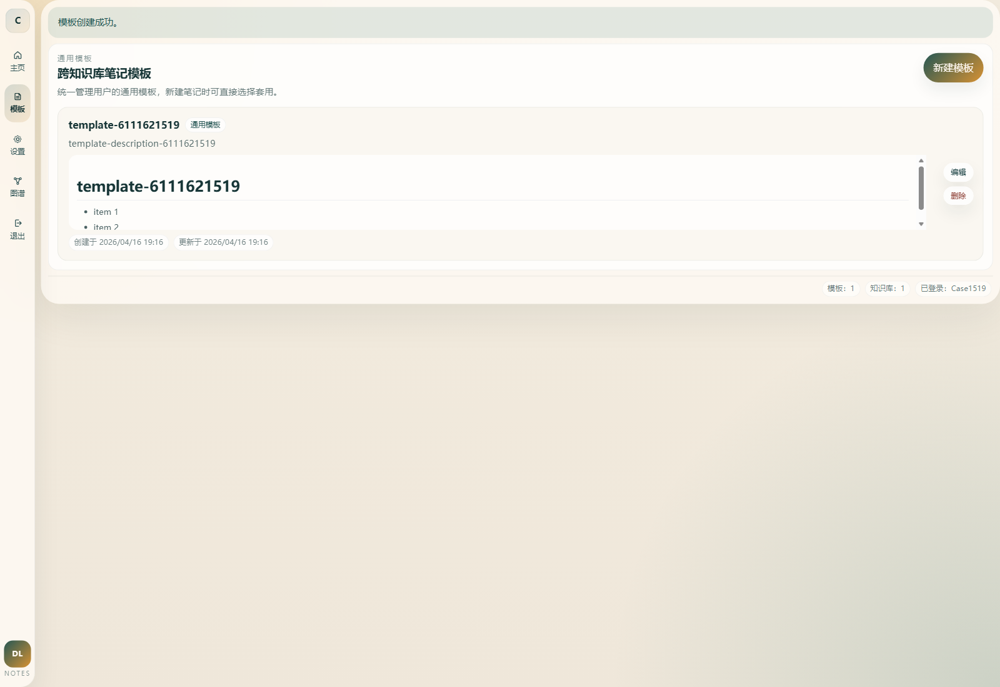

图 6-22 查询模板列表运行截图

## 6.8 用户资料与密码修改模块测试

用户资料与密码修改模块主要验证密码修改流程是否正确，包括前端确认密码一致性校验、原密码正确性校验以及新密码生效验证。

表 6-8 用户资料与密码修改测试用例表

| 测试用例 | 预期结果 | 实际结果 |
| --- | --- | --- |
| 新密码与确认密码不一致 | 修改失败，提示“两次输入的新密码不一致。” | 与预期结果一致 |
| 原密码错误，其他字段正确 | 修改失败，提示“当前密码错误” | 与预期结果一致 |
| 原密码正确，输入新的合法密码 | 修改成功，返回“用户信息更新成功” | 与预期结果一致 |
| 使用新密码重新登录 | 登录成功，说明新密码已生效 | 与预期结果一致 |

用例 6-8-1 新密码与确认密码不一致。

预期结果：系统拦截保存并提示两次新密码不一致。  
实际结果：设置页面出现错误提示，与预期一致。

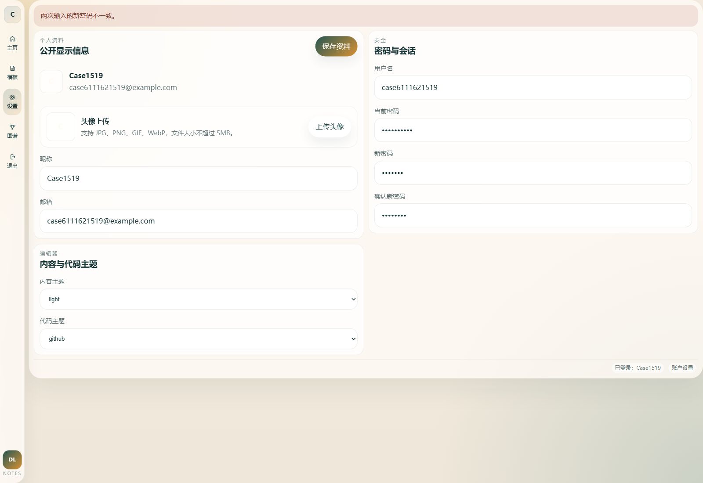

图 6-23 密码确认不一致运行截图

用例 6-8-2 原密码错误。

预期结果：系统提示当前密码错误。  
实际结果：设置页面出现错误提示，与预期一致。

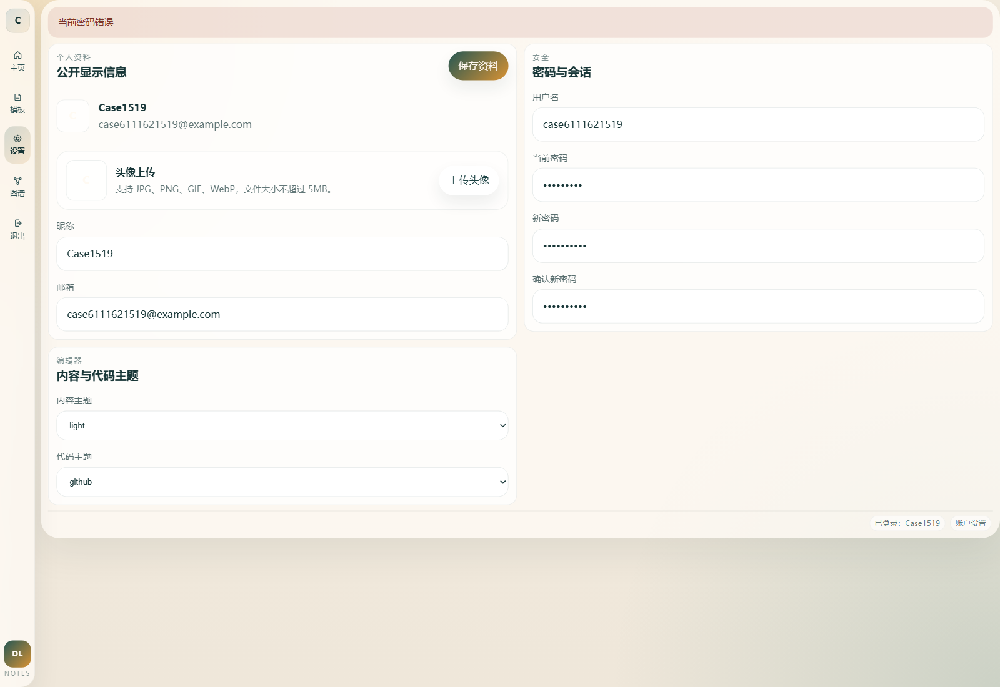

图 6-24 原密码错误运行截图

用例 6-8-3 新密码修改成功。

预期结果：用户资料更新成功，新密码保存生效。  
实际结果：设置页面出现成功提示，与预期一致。

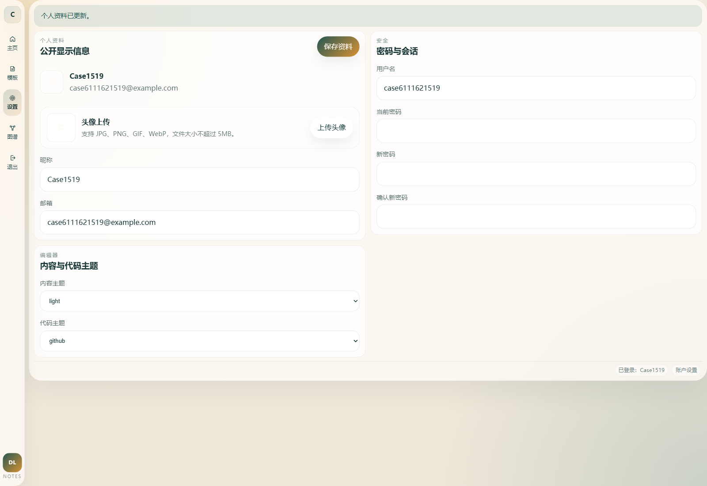

图 6-25 新密码修改成功运行截图

用例 6-8-4 使用新密码重新登录。

预期结果：使用新密码能够重新登录系统。  
实际结果：页面重新登录成功，与预期一致。

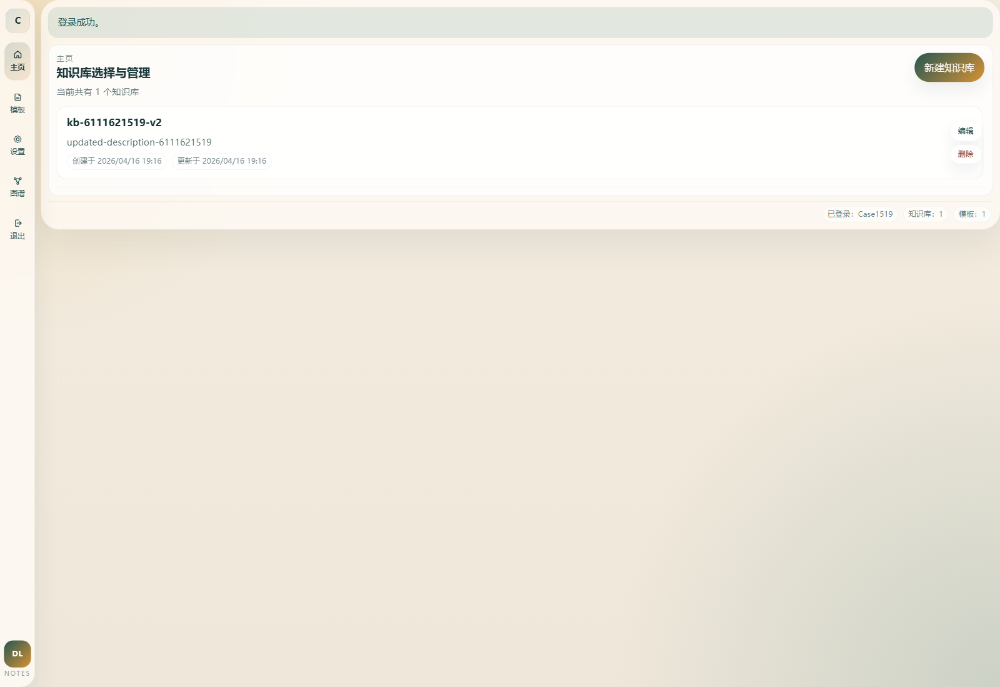

图 6-26 使用新密码重新登录运行截图

## 6.9 测试结果分析

综合上述测试结果可以看出，双链笔记系统的核心功能模块已经通过验证，主要表现如下：

1. 用户认证模块能够正确完成登录、注册、重复账号校验和密码错误拦截。
2. 知识库与目录管理模块能够正常完成知识库创建、修改和目录组织操作。
3. 笔记编辑模块能够完成笔记创建，正文自动保存接口返回正确结果，并在保存后建立双链关系。
4. 历史版本模块能够为笔记创建和查询版本快照。
5. 检索导航与知识图谱模块能够返回正确的检索结果和图谱展示结果。
6. 模板管理模块能够支持模板创建与模板列表读取。
7. 用户资料与密码修改模块能够完成密码一致性校验、原密码校验和新密码生效验证。

从逐用例截图可以进一步说明，本系统的主要业务链路均已在本地真实运行环境下完成验证，测试证据较为完整。

## 6.10 本章小结

本章围绕双链笔记系统的核心功能模块进行了系统测试，并按照“一个测试用例对应一张截图”的方式给出了逐项测试证据。测试内容涵盖了用户认证、知识库与目录管理、笔记编辑、双链关系、历史版本、检索导航、知识图谱、模板管理以及密码修改等关键流程。

总体来看，当前系统主要功能均能够按照设计要求正常运行，关键业务流程闭环完整，已经具备进入论文总结与后续完善分析阶段的基础。本版文档中的 26 张运行截图，也为系统测试结论提供了更加直观、可复核的支撑材料。
